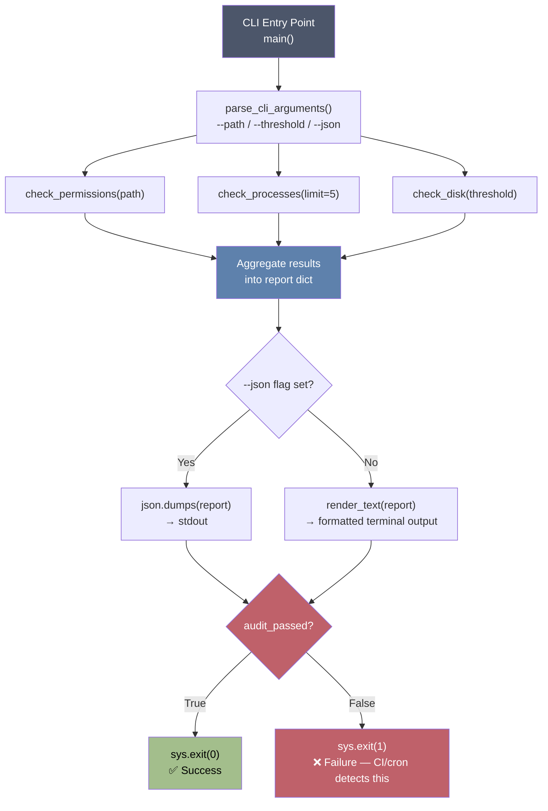

# 🛡️ SysAudit — Local System Security & Health Auditor

[](https://www.python.org/)
[](LICENSE)
[](#)
[](#)

A lightweight, dependency-minimal **CLI auditing tool** that inspects a machine's file permissions, running processes, and disk usage — then reports back in either human-readable or machine-readable (JSON) form, with **CI/cron-friendly exit codes**.

Built as part of a Python-for-DevSecOps learning track, focused on `psutil`, `pathlib`, and clean CLI tool design.

---

## 📌 Table of Contents

- [Why This Project Exists](#-why-this-project-exists)
- [Architecture & Process Flow](#-architecture--process-flow)
- [Features](#-features)
- [Libraries Used & Why](#-libraries-used--why)
- [Installation](#-installation)
- [Usage](#-usage)
- [Sample Output](#-sample-output)
- [Exit Codes](#-exit-codes-for-automationci)
- [Project Structure](#-project-structure)
- [Design Decisions & Trade-offs](#-design-decisions--trade-offs)
- [Known Limitations](#-known-limitations)
- [Roadmap](#-roadmap)
- [License](#-license)

---

## 🎯 Why This Project Exists

On a real fleet of servers, three questions get asked constantly:

1. **"Is any file world-writable and therefore a security risk?"**
2. **"What's eating my CPU/RAM right now?"**
3. **"Is any disk about to fill up and take down the service?"**

Instead of manually running `find`, `top`, and `df` on every box, `sysaudit.py` bundles these three checks into a single script that can be:
- Run manually by an operator,
- Scheduled via `cron` / `systemd timers`,
- Wired into a monitoring pipeline (Nagios, Prometheus Node Exporter script check, CI pre-deploy gate) thanks to its **non-zero exit code on failure**.

---

## 🧭 Architecture & Process Flow



**Reading the diagram:** the script follows a strict **gather → aggregate → render → exit** pipeline. Each check (`check_permissions`, `check_processes`, `check_disk`) is an independent, pure-ish function that takes simple arguments and returns a plain list of dictionaries — no shared state, no side effects other than logging. This is what makes the script easy to unit test and easy to extend (adding a 4th check means adding one function and one line in `main()`).

---

## ✨ Features

| Check | What it does | Flag(s) |
|---|---|---|
| 🔒 **Permission Audit** | Recursively scans a directory for files with the world-writable bit (`o+w`) set — a common misconfiguration that lets *any* local user modify a file. | `--path` |
| 🔥 **Process Monitor** | Lists the top N processes by CPU and memory usage using live OS data. | *(built-in, top 5)* |
| 💾 **Disk Usage Check** | Scans all real (non-loopback) mounted partitions and flags any exceeding a usage threshold. | `--threshold` |
| 🖨️ **Dual Output Modes** | Human-readable terminal report with emoji/status markers, or strict JSON for piping into `jq`, log aggregators, or other scripts. | `--json` |
| 🤖 **Automation-Ready** | Returns exit code `0` (pass) or `1` (fail) — pluggable directly into cron, systemd, or CI pipelines. | *(automatic)* |

---

## 📚 Libraries Used & Why

| Library | Standard Lib? | Purpose in this project |
|---|---|---|
| [`argparse`](https://docs.python.org/3/library/argparse.html) | ✅ Yes | Parses `--path`, `--threshold`, and `--json` into a clean `Namespace` object instead of manually parsing `sys.argv`. Gives free `--help` output and type validation. |
| [`pathlib`](https://docs.python.org/3/library/pathlib.html) | ✅ Yes | Object-oriented filesystem paths. Used via `Path.rglob("*")` for recursive traversal instead of `os.walk`, and `.stat()` / `.owner()` for metadata — cleaner and more readable than raw `os` string-path manipulation. |
| [`stat`](https://docs.python.org/3/library/stat.html) | ✅ Yes | Provides the `S_IWOTH` bitmask constant used to test the "world-writable" permission bit against a file's raw `st_mode` integer. This is the **correct** way to check Unix permissions — never parse `ls -l` text output. |
| [`json`](https://docs.python.org/3/library/json.html) | ✅ Yes | Serializes the final report dictionary into machine-readable output for `--json` mode. |
| [`logging`](https://docs.python.org/3/library/logging.html) | ✅ Yes | Structured, timestamped diagnostic messages (e.g., path-not-found warnings) — safer and more configurable than scattering `print()` calls. |
| [`datetime`](https://docs.python.org/3/library/datetime.html) | ✅ Yes | Stamps every report with a UTC timestamp so results are traceable when logs pile up over time. |
| [`sys`](https://docs.python.org/3/library/sys.html) | ✅ Yes | Used for `sys.exit(code)` (automation-friendly termination) and `sys.stderr` (so error messages don't pollute `--json` stdout output). |
| [`psutil`](https://psutil.readthedocs.io/) | ❌ Third-party | Cross-platform (Linux/macOS/Windows) access to process lists, CPU/memory percentages, disk partitions, and disk usage — abstracting away the need to manually parse `/proc` on Linux or use OS-specific syscalls. The industry-standard library for this. |

> 💡 **Why no `subprocess` calls to `ps`, `df`, or `find`?**
> Shelling out to system binaries and parsing their text output is fragile (output format varies by OS/locale) and can introduce **command injection risks** if any part of the command is built from user input. `psutil` and `pathlib` give the same data through safe, structured Python APIs — no shell involved.

---

## ⚙️ Installation

```bash
# Clone the repository
git clone https://github.com/<your-username>/sysaudit.git
cd sysaudit

# (Recommended) create a virtual environment
python3 -m venv venv
source venv/bin/activate   # On Windows: venv\Scripts\activate

# Install the only dependency
pip install psutil
```

> The script also gracefully self-checks for `psutil` at import time and exits with a clear installation instruction if it's missing — no cryptic `ModuleNotFoundError` traceback.

---

## 🚀 Usage

```bash
# Basic audit of the current directory, human-readable output
python3 sysaudit.py

# Audit a specific directory (e.g., a web server's public folder)
python3 sysaudit.py --path /var/www/html

# Lower the disk alarm threshold to 75%
python3 sysaudit.py --threshold 75

# Get machine-readable JSON (great for piping into jq or a log shipper)
python3 sysaudit.py --path /etc --json | jq .

# Use in a cron job / CI gate — relies on the exit code, not the output
python3 sysaudit.py --path /srv/app --threshold 85 || echo "Audit failed — alerting on-call"
```

### CLI Reference

| Flag | Type | Default | Description |
|---|---|---|---|
| `--path` | `str` | `.` (current dir) | Directory to recursively scan for world-writable files. |
| `--threshold` | `int` | `90` | Disk usage percentage that triggers a warning. |
| `--json` | flag | `False` | Print output as JSON instead of the formatted terminal report. |

---

## 🖥️ Sample Output

**Human-readable mode (`python3 sysaudit.py`):**
```
==================================================
📋 SYSTEM AUDIT REPORT - 2026-07-16 14:32:10Z
==================================================

🔒 [SECURITY: WORLD-WRITABLE FILES]
  ❌ FAIL: /tmp/shared_script.sh (Perms: 0o777, Owner: root)
  ✅ PASS: No world-writable files discovered.

💾 [STORAGE: PARTITION INTEGRITY]
  ❌ ALARM: / (/dev/sda1) is 92.4% full! (184.8GB / 200.0GB)

🔥 [RESOURCE MONITOR: TOP 5 PROCESSES]
  1. chrome (PID: 4821) -> CPU: 24.5% | RAM: 8.32%
  2. python3 (PID: 1023) -> CPU: 12.1% | RAM: 2.14%
  ...
==================================================
```

**JSON mode (`python3 sysaudit.py --json`):**
```json
{
  "timestamp": "2026-07-16 14:32:10Z",
  "unsafe_files": [
    {"file": "/tmp/shared_script.sh", "permissions": "0o777", "owner": "root"}
  ],
  "top_processes": [
    {"pid": 4821, "name": "chrome", "cpu_percent": 24.5, "memory_percent": 8.32}
  ],
  "disk_warnings": [
    {"device": "/dev/sda1", "mount_point": "/", "total_gb": 200.0, "used_gb": 184.8, "percent_used": 92.4, "threshold": 90}
  ],
  "audit_passed": false
}
```

---

## 🔢 Exit Codes (for automation/CI)

| Code | Meaning |
|---|---|
| `0` | All checks passed — no unsafe files, no disk threshold breaches. |
| `1` | At least one check failed — inspect the report for details. |

This makes the script a drop-in health-check step for:
- **cron**: pair with `mail` or a webhook on non-zero exit.
- **systemd**: use as an `ExecStartPre` gate.
- **CI/CD**: fail a pipeline stage if a build artifact directory contains unsafe permissions before packaging.

---

## 📂 Project Structure

```
sysaudit/
├── sysaudit.py       # Main script — all logic lives here (single-file CLI tool)
├── README.md         # You are here
└── requirements.txt  # psutil
```

---

## 🧠 Design Decisions & Trade-offs

- **Single-file script over a package:** at this scope, one file is easier to read, review, and deploy (just `scp` it to a server) than a multi-module package. This will change if the tool grows plugin-style checks.
- **`Path.rglob` over `os.walk`:** more Pythonic and readable, at the cost of slightly less control over traversal (e.g., can't easily prune directories mid-walk the way `os.walk` allows). Acceptable trade-off for an audit tool run on bounded directories.
- **Silent `continue` on `PermissionError`:** scanning `/` as a non-root user *will* hit directories you can't read. Skipping them (rather than crashing) keeps the audit useful, though it means the report reflects "what I could see," not "the whole truth." This is called out here so it's not a silent blind spot.
- **`cpu_percent` on first call:** `psutil.process_iter` with `cpu_percent` in the attribute list returns `0.0` (or `None`) on the very first sample for each process, since CPU% requires two measurements over an interval. This is a known `psutil` quirk — good enough for a snapshot tool, but worth knowing if the numbers look suspiciously low on a fresh run.

---

## ⚠️ Known Limitations

- CPU percentages are a **single instantaneous sample**, not an average over time — for trend analysis, the script would need to sample twice with a delay (`psutil.cpu_percent(interval=1)`).
- Does not currently support **remote hosts** — this is intentionally a local-only tool (see the companion project: an SSH-based fleet auditor, coming next in this series).
- `path.owner()` can raise on some systems (e.g., Windows, or UIDs with no matching user entry) — currently caught defensively but reported as `"unknow"` (see Roadmap).

---

## 🗺️ Roadmap

- [ ] Fix typo: `"unknow"` → `"unknown"`
- [ ] Add `--exclude` flag to skip noisy directories (`node_modules`, `.git`, etc.)
- [ ] Add unit tests (`pytest`) with mocked `psutil` calls
- [ ] Add a `--config` option to load thresholds from a YAML file
- [ ] Package as a proper CLI entry point (`pip install .` → `sysaudit` command)
- [ ] Add SUID/SGID binary detection alongside world-writable checks

---

## 📄 License

This project is licensed under the MIT License — see the [LICENSE](LICENSE) file for details.

---

## 🙋 About

Built as part of a self-directed Platform/DevSecOps Python automation curriculum, focused on system introspection, secure scripting practices, and building CI/cron-ready operational tooling.