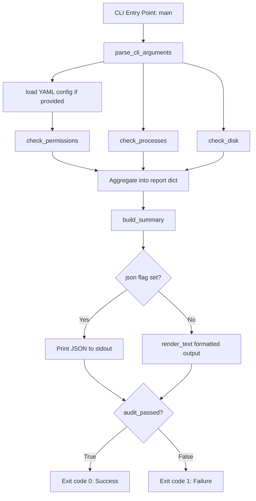

# 🛡️ SysAudit — Local System Security & Health Auditor

[](https://www.python.org/)
[](LICENSE)
[](#)
[](#)

A lightweight, dependency-minimal **CLI auditing tool** that inspects a machine's file permissions, running processes, and disk usage — then reports back in either human-readable or machine-readable (JSON) form, with **CI/cron-friendly exit codes**.

The tool now also supports **YAML-driven scoped audits** via [auditor_config.yaml](auditor_config.yaml), so one run can scan multiple directories with custom recursion depth, exclusion rules, and permissive-permission handling.

Built as part of a Python-for-DevSecOps learning track, focused on `psutil`, `pathlib`, and clean CLI tool design.

---

## 📌 Table of Contents

- [Why This Project Exists](#-why-this-project-exists)
- [Architecture & Process Flow](#-architecture--process-flow)
- [Features](#-features)
- [Libraries Used & Why](#-libraries-used--why)
- [Installation](#-installation)
- [Usage](#-usage)
- [Sample Output](#-sample-output)
- [Exit Codes](#-exit-codes-for-automationci)
- [Project Structure](#-project-structure)
- [Design Decisions & Trade-offs](#-design-decisions--trade-offs)
- [Known Limitations](#-known-limitations)
- [Roadmap](#-roadmap)
- [License](#-license)

---

## 🎯 Why This Project Exists

On a real fleet of servers, three questions get asked constantly:

1. **"Is any file world-writable and therefore a security risk?"**
2. **"What's eating my CPU/RAM right now?"**
3. **"Is any disk about to fill up and take down the service?"**

Instead of manually running `find`, `top`, and `df` on every box, `sysaudit.py` bundles these three checks into a single script that can be:
- Run manually by an operator,
- Scheduled via `cron` / `systemd timers`,
- Wired into a monitoring pipeline (Nagios, Prometheus Node Exporter script check, CI pre-deploy gate) thanks to its **non-zero exit code on failure**.

---

## 🧭 Architecture & Process Flow



**Reading the diagram:** the script follows a strict **gather → summarize → render → exit** pipeline. When a YAML config is supplied, the tool expands each target path and applies the configured recursion depth, ignore rules, and permissive-permission policy. Results are then summarized into a compact metadata block before being emitted as JSON or human-readable output.

---

## ✨ Features

| Check | What it does | Flag(s) |
|---|---|---|
| 🔒 **Permission Audit** | Recursively scans a directory for files with the world-writable bit (`o+w`) set — a common misconfiguration that lets *any* local user modify a file. | `--path`, `--config` |
| 🔥 **Process Monitor** | Lists the top N processes by CPU and memory usage using live OS data. | *(built-in, top 5)* |
| 💾 **Disk Usage Check** | Scans all real (non-loopback) mounted partitions and flags any exceeding a usage threshold. | `--threshold` |
| 🖨️ **Dual Output Modes** | Human-readable terminal report with emoji/status markers, or strict JSON for piping into `jq`, log aggregators, or other scripts. | `--json` |
| 🧭 **Scoped YAML Targets** | Reads targets and rules from [auditor_config.yaml](auditor_config.yaml) for multi-target scans with custom depth and ignore patterns. | `--config` |
| 🤖 **Automation-Ready** | Returns exit code `0` (pass) or `1` (fail) — pluggable directly into cron, systemd, or CI pipelines. | *(automatic)* |

---

## 📚 Libraries Used & Why

| Library | Standard Lib? | Purpose in this project |
|---|---|---|
| [`argparse`](https://docs.python.org/3/library/argparse.html) | ✅ Yes | Parses CLI flags such as `--path`, `--threshold`, `--config`, `--exclude`, `--max-findings`, and `--only-failures` into a clean `Namespace` object. |
| [`pathlib`](https://docs.python.org/3/library/pathlib.html) | ✅ Yes | Used for path normalization, existence checks, and writing the output report file in the fleet wrapper. |
| [`stat`](https://docs.python.org/3/library/stat.html) | ✅ Yes | Used to inspect file mode bits and determine whether a file is permissive or world-writable. |
| [`json`](https://docs.python.org/3/library/json.html) | ✅ Yes | Serializes the final report dictionary into machine-readable output for `--json` mode. |
| [`logging`](https://docs.python.org/3/library/logging.html) | ✅ Yes | Structured, timestamped diagnostic messages for CLI and fleet operations. |
| [`datetime`](https://docs.python.org/3/library/datetime.html) | ✅ Yes | Stamps every report with a UTC timestamp so results are traceable when logs pile up over time. |
| [`sys`](https://docs.python.org/3/library/sys.html) | ✅ Yes | Used for automation-friendly exit codes and stderr handling. |
| [`psutil`](https://psutil.readthedocs.io/) | ❌ Third-party | Cross-platform access to process lists, CPU/memory percentages, disk partitions, and disk usage. |
| [`yaml`](https://pyyaml.org/) | ❌ Third-party | Parses [auditor_config.yaml](auditor_config.yaml) and turns its `targets` section into scoped scan instructions. |

> 💡 **Why no `subprocess` calls to `ps`, `df`, or `find`?**
> Shelling out to system binaries and parsing their text output is fragile (output format varies by OS/locale) and can introduce **command injection risks** if any part of the command is built from user input. `psutil` and `pathlib` give the same data through safe, structured Python APIs — no shell involved.

---

## ⚙️ Installation

```bash
# Clone the repository
git clone https://github.com/<your-username>/sysaudit.git
cd sysaudit

# (Recommended) create a virtual environment
python3 -m venv venv
source venv/bin/activate   # On Windows: venv\Scripts\activate

# Install the runtime dependencies
pip install -r requirements.txt
```

> The script also gracefully self-checks for `psutil` and `PyYAML` at import time and exits with a clear installation instruction if either dependency is missing — no cryptic `ModuleNotFoundError` traceback.

---

## 🚀 Usage

```bash
# Basic audit of the current directory, human-readable output
python3 sysaudit.py

# Audit a specific directory (e.g., a web server's public folder)
python3 sysaudit.py --path /var/www/html

# Run a YAML-driven audit using auditor_config.yaml
python3 sysaudit.py --config auditor_config.yaml --json

# Lower the disk alarm threshold to 75%
python3 sysaudit.py --threshold 75

# Exclude noisy paths such as .git or node_modules
python3 sysaudit.py --config auditor_config.yaml --exclude .git/* node_modules/*

# Limit the number of findings shown in text mode
python3 sysaudit.py --config auditor_config.yaml --max-findings 10

# Get machine-readable JSON (great for piping into jq or a log shipper)
python3 sysaudit.py --path /etc --json | jq .

# Use in a cron job / CI gate — relies on the exit code, not the output
python3 sysaudit.py --path /srv/app --threshold 85 || echo "Audit failed — alerting on-call"
```

### CLI Reference

| Flag | Type | Default | Description |
|---|---|---|---|
| `--path` | `str` | `.` (current dir) | Directory to recursively scan for world-writable files. |
| `--threshold` | `int` | `90` | Disk usage percentage that triggers a warning. |
| `--json` | flag | `False` | Print output as JSON instead of the formatted terminal report. |
| `--config` / `--config-path` | `str` | `None` | Path to a YAML file containing scoped scan targets. |
| `--exclude` | list | `[]` | Extra path globs to skip during scanning. |
| `--max-findings` | `int` | `20` | Maximum number of findings to print in text mode. |
| `--only-failures` | flag | `False` | Show only the summary and finding list in text mode. |

### YAML Configuration Format

The YAML config supports a top-level `global_settings` block and a `targets` list. Each target can define:

```yaml
global_settings:
  output_format: "json"
  follow_symlinks: false
  show_owner_group: true

targets:
  - name: "example_target"
    path: "~/example"
    max_depth: 3
    ignore_patterns:
      - "*.log"
      - "cache/*"
    alert_on_permissive: true
```

The current implementation uses the `targets` entries to scan each configured directory and collect findings into one unified report.

---

## 🖥️ Sample Output

**Human-readable mode (`python3 sysaudit.py`):**
```
==================================================
📋 SYSTEM AUDIT REPORT - 2026-07-16 14:32:10Z
==================================================

🔒 [SECURITY: WORLD-WRITABLE FILES]
  ❌ FAIL: /tmp/shared_script.sh (Perms: 0o777, Owner: root)
  ✅ PASS: No world-writable files discovered.

💾 [STORAGE: PARTITION INTEGRITY]
  ❌ ALARM: / (/dev/sda1) is 92.4% full! (184.8GB / 200.0GB)

🔥 [RESOURCE MONITOR: TOP 5 PROCESSES]
  1. chrome (PID: 4821) -> CPU: 24.5% | RAM: 8.32%
  2. python3 (PID: 1023) -> CPU: 12.1% | RAM: 2.14%
  ...
==================================================
```

**JSON mode (`python3 sysaudit.py --config auditor_config.yaml --json`):**
```json
{
  "timestamp": "2026-07-17 18:31:59Z",
  "unsafe_files": [
    {"path": "/home/user/project/.git/objects/abc", "permissions": "0o666", "size": 55}
  ],
  "top_processes": [
    {"pid": 4821, "name": "chrome", "cpu_percent": 0.0, "memory_percent": 8.32}
  ],
  "disk_warnings": [],
  "summary": {
    "total_findings": 48,
    "high_risk_findings": 48,
    "permission_breakdown": {"0o666": 8, "0o777": 40},
    "disk_warning_count": 0
  },
  "audit_passed": false
}
```

---

## 🔢 Exit Codes (for automation/CI)

| Code | Meaning |
|---|---|
| `0` | All checks passed — no unsafe files, no disk threshold breaches. |
| `1` | At least one check failed — inspect the report for details. |

This makes the script a drop-in health-check step for:
- **cron**: pair with `mail` or a webhook on non-zero exit.
- **systemd**: use as an `ExecStartPre` gate.
- **CI/CD**: fail a pipeline stage if a build artifact directory contains unsafe permissions before packaging.

---

## 📂 Project Structure

```
Automation/
├── sysaudit.py           # Local audit engine with YAML config support
├── fleetaudit.py         # SSH-based fleet wrapper that pushes the audit script to remote hosts
├── auditor_config.yaml   # Example YAML targets and rules for multi-scope audits
├── hosts.txt             # Inventory of remote hosts for fleet mode
├── fleet_report.json     # Generated aggregate report from a fleet run
├── requirements.txt      # Runtime dependencies: psutil and PyYAML
└── README.md             # Project documentation
```

---

## 🧠 Design Decisions & Trade-offs

- **Single-file script over a package:** at this scope, one file is easier to read, review, and deploy (just `scp` it to a server) than a multi-module package. This remains true for now, though the fleet wrapper is intentionally separate for SSH orchestration.
- **YAML-driven target definitions over hard-coded CLI-only paths:** this makes the tool more flexible for scoped audits, especially across developer repos and extension directories.
- **Silent `continue` on `PermissionError`:** scanning directories as a non-root user can hit access-restricted paths. Skipping them keeps the audit useful, though it means the report reflects what the current account could inspect.
- **Default exclusions for noisy paths:** the permission scan now skips common directories such as `.git`, `node_modules`, and caches by default to reduce noise and keep the report focused.
- **`cpu_percent` on first call:** `psutil.process_iter` with `cpu_percent` in the attribute list returns `0.0` (or `None`) on the very first sample for each process, since CPU% requires two measurements over an interval. This is a known `psutil` quirk — good enough for a snapshot tool, but worth knowing if the numbers look suspiciously low on a fresh run.

---

## ⚠️ Known Limitations

- CPU percentages are a **single instantaneous sample**, not an average over time — for trend analysis, the script would need to sample twice with a delay (`psutil.cpu_percent(interval=1)`).
- The new fleet mode is SSH-based and remote-target aware, but it still assumes key-based access and a reachable inventory list.
- The YAML config is currently used for target discovery and rule application, but it does not yet support every possible filesystem policy or custom output schema.

---

## 🗺️ Roadmap

- [x] Add `--exclude` flag to skip noisy directories (`node_modules`, `.git`, etc.)
- [x] Add a `--config` option to load targets and rules from a YAML file
- [ ] Add unit tests (`pytest`) with mocked `psutil` calls
- [ ] Package as a proper CLI entry point (`pip install .` → `sysaudit` command)
- [ ] Add SUID/SGID binary detection alongside world-writable checks
- [ ] Add richer severity levels and remediation hints in the output schema

---

## 📄 License

This project is licensed under the MIT License — see the [LICENSE](LICENSE) file for details.

---

## 🙋 About

Built as part of a self-directed Platform/DevSecOps Python automation curriculum, focused on system introspection, secure scripting practices, and building CI/cron-ready operational tooling.